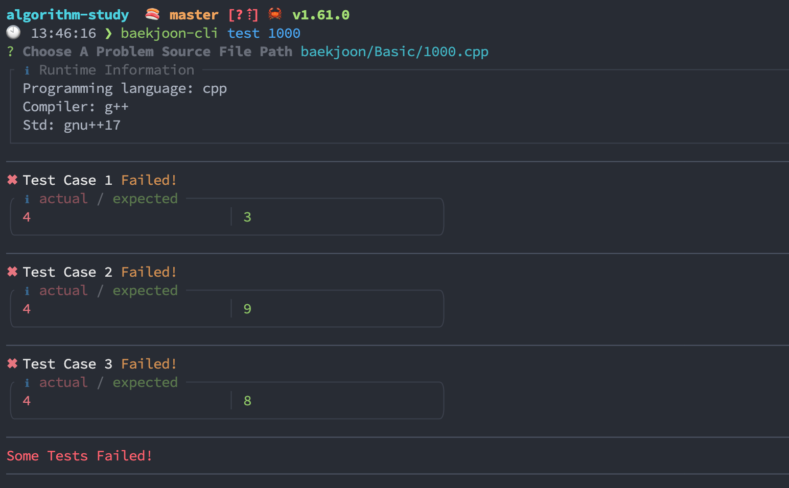
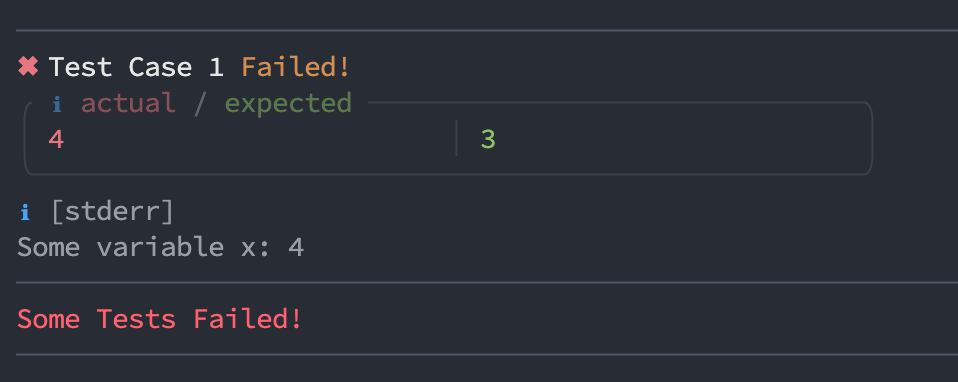
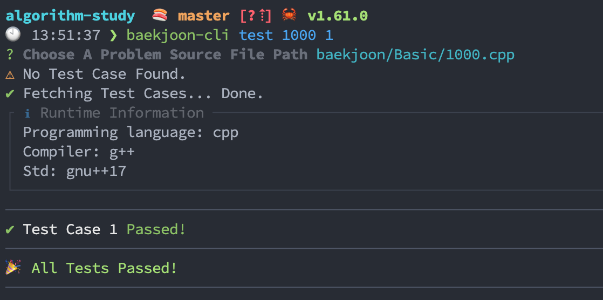

# baekjoon-cli-utils

[](http://badge.fury.io/js/baekjoon-cli-utils)
[](http://badge.fury.io/js/baekjoon-cli-utils)
[](https://lbesson.mit-license.org/)

> Simple code runner and CLI tool for studying, testing and managing [Baekjoon](https://www.acmicpc.net/) algorithm source codes efficiently. Cross-platform.

## Features

* Create the source code through code template by programming language.


* Just run your single algorithm source code regardless of your language details (compiler, cli command tools... etc).



* Pretty print stdout, stderr formats separately.



* Download and run all tests at once, and add the test you need manually.



* Use automatic commit convention through commit template.

Disclaimer:

* This program doesn't handle [Special-Judge problems](https://help.acmicpc.net/judge/info) properly.

## Install

1. Install the program through `npm`.

```
$ npm i -g baekjoon-cli-utils
```

2. Move into your project's root. (where the `.git` folder exists)

3. Configure a programming language and code template.

```
$ baekjoon-cli config lang
$ baekjoon-cli config code-template
```

## Usage

```
$ baekjoon-cli --help

  Commands
    create          Create the problem source code on the subdirectory, and fetch tests.
    test            Find, compile and run a problem source code, and print test results in pretty format.
    add-test        Add additional test manually by code editor.
    edit-test       Edit test manually by code editor.
    clear-test      Clear the specified problem's test.
    clear-tests     Clear all the problem's tests.
    view-tests      Print the problem's tests.
    open            Open the problem's URL in your browser.
    commit          Commit the problem source code to Git.
    config          Check and update templates, configurations.

  Usage
    $ baekjoon-cli [create <problem_identifier>]
    $ baekjoon-cli [test <problem_identifier>]
    $ baekjoon-cli [debug <problem_identifier> <test_index>]
    $ baekjoon-cli [add-test <problem_identifier>]
    $ baekjoon-cli [edit-test <problem_identifier> <test_index>]
    $ baekjoon-cli [open <problem_identifier>]
    $ baekjoon-cli [commit <problem_identifier>]
    $ baekjoon-cli [clear-test <problem_identifier> <test_index>]
    $ baekjoon-cli [clear-tests <problem_identifier>]
    $ baekjoon-cli [view-tests <problem_identifier>]

  Configs
    show            Show current configurations.
    lang            Default programming language to use.
    timeout         A timeout value of test runner. Test runner exit the test if the running time is greater than this value.
    code-template   Code template used by \`create\`.
    commit-message  Commit message template used by \`commit\`.

  Usage
    $ baekjoon-cli [config show]
    $ baekjoon-cli [config lang <language>]
    $ baekjoon-cli [config timeout <ms>]
    $ baekjoon-cli [config code-template]
    $ baekjoon-cli [config commit-message]

  Options
    --raw           Print stdout in raw format in test runner.
                    It could be useful when you debug the source code with an infinity loop since test runner will not wait for the child process to exit.

  Flag Examples
    $ baekjoon-cli test --raw 1000
```

## Supported languages

- [x] C++
- [x] C
- [x] Java
- [x] Node.js
- [x] Python
- [x] Go
- [x] Rust
- [x] Swift
- [x] Ruby
- [ ] Kotlin
- [ ] D

## Runtime configuration

By default, this program use below tools for running tests.

So, make sure the corresponding tool should be setup on your computer.

| Programming language | Compiler / Interpreter   |
| -------------------- | ------------------------ |
| c                    | `gcc`                    |
| c++                  | `g++`                    |
| go                   | `go`                     |
| java                 | `javac`                  |
| javascript           | `node`                   |
| python               | `python3`                |
| ruby                 | `ruby`                   |
| rust                 | `rustc`                  |
| swift                | `swiftc`                 |

You can change some test runner's configuration through creating `runner-settings.json` file to your working directory.

See also [runner's default configuration](./runner-settings.json).

## Source code template

You can create some code templates by your programming language.

This template file is used when you use `baekjoon-cli create`.

You can edit the template file through `baekjoon-cli config code-template`.

The `{variable}`s in the template are replaced with the according value.

| Variable             | value                  |
| -------------------- | ---------------------- |
| id                   | Problem identifier     |
| title                | Problem title          |
| text                 | Problem texts          |
| input                | Problem input test     |
| output               | Problem output test    |
| url                  | Problem url            |
| date                 | File created date      |

## Git commit template

Used when you use `baekjoon-cli commit`.

The `{variable}`s in the template are replaced with the according value.

| Variable              | value                  |
| --------------------- | ---------------------- |
| id                    | Problem identifier     |
| title                 | Problem title          |
| url                   | Problem url            |
| date                  | File created date      |
| relativeDirectoryPath | Problem relative path  |

## Code editor setting

Some command requires executing your source code editor. You can change the editor to use by setting the `EDITOR` environment variable to what you want.

## Example

- [algorithm-study](https://github.com/jopemachine/algorithm-study)
